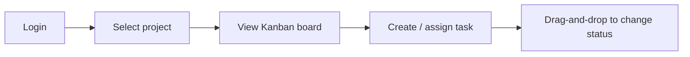

# PRD — TeamTask (Ứng dụng quản lý công việc nhóm)

## Thông tin tài liệu (Document Metadata)

| Trường                           | Giá trị           |
| -------------------------------- | ----------------- |
| Tên dự án (Project)              | TeamTask          |
| Mã tài liệu (Doc ID)             | PRD-001           |
| Loại (Type)                      | PRD               |
| Phiên bản (Version)              | 1.0.0             |
| Trạng thái (Status)              | Approved          |
| Người viết (Author)              | Nguyễn Văn A (PM) |
| Người duyệt (Approver)           | Trần Thị B (CEO)  |
| Ngày tạo (Created)               | 2026-05-20        |
| Cập nhật lần cuối (Last updated) | 2026-06-01        |

## 1. Tóm tắt (TL;DR)

TeamTask là ứng dụng web giúp các nhóm nhỏ (5–20 người) tạo công việc (task), gán người phụ trách và theo dõi tiến độ trên bảng Kanban. Mục tiêu thay thế việc quản lý công việc rời rạc qua chat/Excel bằng một nơi tập trung, trực quan.

## 2. Bối cảnh & Vấn đề (Background & Problem)

Các nhóm hiện trao đổi công việc qua chat và file Excel, dẫn tới: thất lạc đầu việc, không rõ ai làm gì, khó nắm tiến độ tổng thể. Quản lý mất nhiều thời gian tổng hợp trạng thái thủ công.

## 3. Mục tiêu & Chỉ số thành công (Goals & Success Metrics)

| Mục tiêu (Goal)         | Chỉ số (Metric / KPI)                  | Mục tiêu cụ thể (Target) |
| ----------------------- | -------------------------------------- | ------------------------ |
| Tập trung hóa công việc | Số nhóm dùng hằng tuần (WAU theo team) | ≥ 50 nhóm sau 3 tháng    |
| Tăng minh bạch tiến độ  | % task có người phụ trách              | ≥ 90%                    |
| Giảm thời gian tổng hợp | Thời gian tạo báo cáo tiến độ          | < 1 phút                 |

**Ngoài phạm vi mục tiêu (Non-goals):** quản lý thời gian (time tracking), tính lương, biểu đồ Gantt — để các phiên bản sau.

## 4. Phạm vi (Scope)

- **Trong phạm vi (In scope):** đăng nhập, tạo/sửa dự án, tạo/gán/cập nhật task theo Kanban, bình luận (comment) trong task.
- **Ngoài phạm vi (Out of scope):** ứng dụng mobile native, tích hợp bên thứ ba (Slack/Jira), phân quyền nâng cao theo từng trường.

## 5. Đối tượng người dùng (Personas)

| Persona                     | Mô tả                                | Nhu cầu chính (Key needs)                     |
| --------------------------- | ------------------------------------ | --------------------------------------------- |
| Quản lý nhóm (Team Manager) | Người tạo dự án, giao việc, theo dõi | Thấy toàn cảnh tiến độ, biết ai trễ           |
| Thành viên (Member)         | Người thực hiện task                 | Biết việc của mình, cập nhật trạng thái nhanh |

## 6. Yêu cầu chức năng (Functional Requirements)

| ID    | Mô tả (Description)                            | User Story                                                   | Ưu tiên (Priority — MoSCoW) | Ghi chú                                |
| ----- | ---------------------------------------------- | ------------------------------------------------------------ | --------------------------- | -------------------------------------- |
| FR-01 | Đăng nhập bằng email/mật khẩu                  | Là người dùng, tôi muốn đăng nhập để truy cập dự án của mình | Must                        |                                        |
| FR-02 | Tạo & quản lý dự án                            | Là Quản lý nhóm, tôi muốn tạo dự án để nhóm công việc        | Must                        |                                        |
| FR-03 | Tạo task với tiêu đề, mô tả, hạn (due date)    | Là thành viên, tôi muốn tạo task để ghi lại đầu việc         | Must                        |                                        |
| FR-04 | Gán task cho thành viên (assignee)             | Là Quản lý nhóm, tôi muốn gán việc để rõ trách nhiệm         | Must                        |                                        |
| FR-05 | Cập nhật trạng thái task trên Kanban (kéo–thả) | Là thành viên, tôi muốn đổi trạng thái để phản ánh tiến độ   | Must                        | Trạng thái: To Do / In Progress / Done |
| FR-06 | Bình luận trong task                           | Là thành viên, tôi muốn trao đổi ngay trong task             | Should                      |                                        |
| FR-07 | Lọc task theo người phụ trách / trạng thái     | Là Quản lý nhóm, tôi muốn lọc để xem nhanh                   | Should                      |                                        |
| FR-08 | Thông báo khi được gán task                    | Là thành viên, tôi muốn được báo khi có việc mới             | Could                       | Email ở v1                             |

## 7. Yêu cầu phi chức năng (Non-functional Requirements)

| Loại                              | Yêu cầu                                                           |
| --------------------------------- | ----------------------------------------------------------------- |
| Hiệu năng (Performance)           | Bảng Kanban tải < 2 giây với ≤ 500 task                           |
| Bảo mật (Security)                | Mật khẩu băm bằng bcrypt; phiên đăng nhập qua JWT; HTTPS bắt buộc |
| Khả dụng (Availability)           | Uptime ≥ 99.5%                                                    |
| Khả năng truy cập (Accessibility) | Đạt WCAG 2.1 mức AA cho các màn chính                             |

## 8. Luồng người dùng chính (Key User Flows)

## 9. Tiêu chí nghiệm thu (Acceptance Criteria)

- [ ] Người dùng đăng nhập sai mật khẩu nhận thông báo lỗi rõ ràng, không lộ thông tin.
- [ ] Khi tạo task và gán cho thành viên, task xuất hiện ở cột "To Do" của dự án đó.
- [ ] Kéo task sang cột "Done" thì trạng thái được lưu và phản ánh khi tải lại trang.
- [ ] Bình luận hiển thị kèm tên người và thời gian.

## 10. Phụ thuộc & Rủi ro (Dependencies & Risks)

| Mục                          | Loại      | Ảnh hưởng                  | Phương án giảm thiểu (Mitigation)                          |
| ---------------------------- | --------- | -------------------------- | ---------------------------------------------------------- |
| Dịch vụ gửi email            | Phụ thuộc | FR-08 không chạy nếu thiếu | Dùng nhà cung cấp email (vd SendGrid), có hàng đợi (queue) |
| Hiệu năng kéo-thả nhiều task | Rủi ro    | Trải nghiệm chậm           | Phân trang/ảo hóa danh sách (virtualization)               |

## 11. Mốc thời gian (Milestones)

| Mốc (Milestone) | Mô tả                           | Ngày dự kiến |
| --------------- | ------------------------------- | ------------ |
| M1              | Đăng nhập + Dự án + Task cơ bản | 2026-06-30   |
| M2              | Kanban kéo-thả + Bình luận      | 2026-07-31   |
| M3              | Lọc + Thông báo email           | 2026-08-31   |

## 12. Câu hỏi mở (Open Questions)

- [ ] Có cần phân quyền chỉ-xem (viewer role) ở v1 không?
- [ ] Giới hạn số thành viên tối đa mỗi dự án?

---

## Lịch sử thay đổi (Change History)

| Phiên bản | Ngày       | Người sửa    | Mô tả thay đổi                 |
| --------- | ---------- | ------------ | ------------------------------ |
| 0.1.0     | 2026-05-20 | Nguyễn Văn A | Khởi tạo bản nháp              |
| 1.0.0     | 2026-06-01 | Nguyễn Văn A | Chốt phạm vi v1, duyệt bởi CEO |
