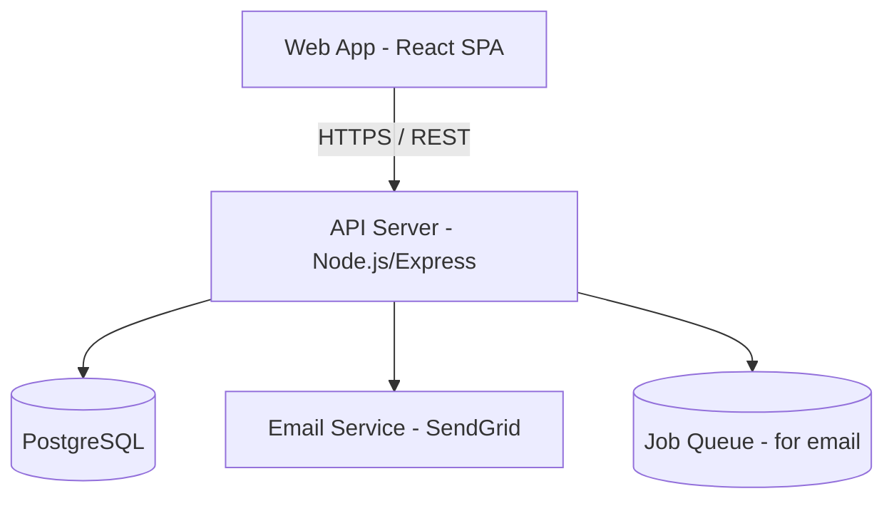
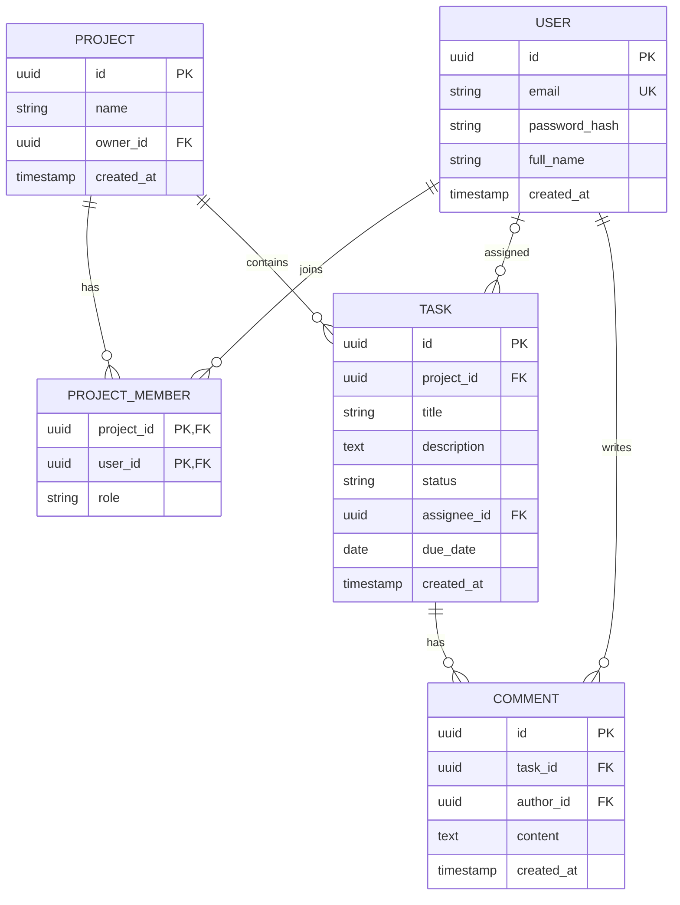
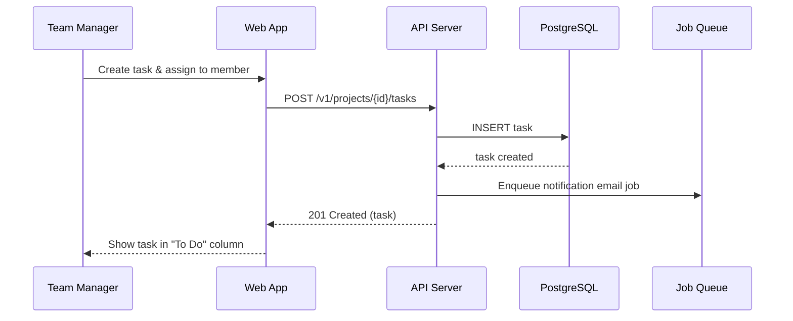

# Technical Design — TeamTask

## Thông tin tài liệu (Document Metadata)

| Trường                           | Giá trị                    |
| -------------------------------- | -------------------------- |
| Tên dự án (Project)              | TeamTask                   |
| Mã tài liệu (Doc ID)             | TDD-001                    |
| Loại (Type)                      | Technical Design           |
| Phiên bản (Version)              | 1.0.0                      |
| Trạng thái (Status)              | Approved                   |
| Người viết (Author)              | Lê Văn C (Tech Lead)       |
| Người duyệt (Approver)           | Nguyễn Văn A (PM)          |
| Tài liệu liên quan (Related)     | PRD-001, API-001, UIUX-001 |
| Ngày tạo (Created)               | 2026-05-25                 |
| Cập nhật lần cuối (Last updated) | 2026-06-02                 |

## 1. Tổng quan & Mục tiêu kỹ thuật (Overview & Technical Goals)

Xây dựng ứng dụng web dạng SPA (Single-Page Application) giao tiếp với REST API. Mục tiêu kỹ thuật: phản hồi nhanh cho thao tác Kanban, kiến trúc đơn giản dễ bảo trì cho nhóm nhỏ, mở rộng được khi số dự án tăng.

## 2. Ràng buộc & Giả định (Constraints & Assumptions)

- **Ràng buộc (Constraints):** ngân sách hạ tầng thấp; team 2 backend + 1 frontend; ra mắt v1 trong 3 tháng.
- **Giả định (Assumptions):** quy mô ≤ 50 nhóm, ≤ 500 task/dự án ở giai đoạn đầu.

## 3. Kiến trúc tổng thể (Architecture Overview)

- **Web App:** React, gọi REST API, lưu JWT ở bộ nhớ + refresh token.
- **API Server:** Node.js/Express, xử lý nghiệp vụ và xác thực.
- **PostgreSQL:** lưu trữ chính.
- **Email Service + Queue:** xử lý thông báo (FR-08) bất đồng bộ.

## 4. Công nghệ sử dụng (Tech Stack)

| Tầng (Layer)                   | Công nghệ                                      | Lý do chọn (Rationale)                          |
| ------------------------------ | ---------------------------------------------- | ----------------------------------------------- |
| Frontend                       | React + TypeScript, thư viện kéo-thả (dnd-kit) | Hệ sinh thái mạnh, type-safe                    |
| Backend                        | Node.js + Express + TypeScript                 | Cùng ngôn ngữ với FE, team quen                 |
| Cơ sở dữ liệu (Database)       | PostgreSQL                                     | Quan hệ rõ ràng, hỗ trợ giao dịch (transaction) |
| Xác thực (Auth)                | JWT (access + refresh token)                   | Không trạng thái (stateless), dễ mở rộng        |
| Hạ tầng (Infrastructure)       | Docker + 1 VPS (giai đoạn đầu)                 | Chi phí thấp, đủ dùng                           |
| Dịch vụ bên thứ ba (3rd-party) | SendGrid (email)                               | Triển khai nhanh                                |

## 5. Mô hình dữ liệu (Data Model)

### 5.1. Sơ đồ ERD (Entity-Relationship Diagram)

> Ký hiệu: `PK` = khóa chính (Primary Key), `FK` = khóa ngoại (Foreign Key), `UK` = khóa duy nhất (Unique Key).

### 5.2. Quan hệ (Relationships)

- Một **User** tham gia nhiều **Project** và một **Project** có nhiều thành viên → quan hệ **nhiều–nhiều (many-to-many)**, biểu diễn qua bảng nối (join table) `project_members`.
- Một **Project** chứa nhiều **Task** → **một–nhiều (one-to-many)**.
- Một **Task** được gán cho **tối đa một** **User** (`assignee_id` có thể `NULL` khi chưa gán).
- Một **Task** có nhiều **Comment**; mỗi **Comment** do **một** **User** viết.

### 5.3. Chi tiết các bảng (Table Details)

#### Bảng `users`

| Trường (Field) | Kiểu (Type)  | Ràng buộc (Constraint)    | Mô tả                    |
| -------------- | ------------ | ------------------------- | ------------------------ |
| id             | uuid         | PK                        | Định danh người dùng     |
| email          | varchar(255) | UNIQUE, NOT NULL          | Email đăng nhập          |
| password_hash  | varchar(255) | NOT NULL                  | Mật khẩu băm bằng bcrypt |
| full_name      | varchar(100) | NOT NULL                  | Họ tên hiển thị          |
| created_at     | timestamptz  | NOT NULL, default `now()` | Thời điểm tạo            |

#### Bảng `projects`

| Trường (Field) | Kiểu (Type)  | Ràng buộc (Constraint)    | Mô tả                 |
| -------------- | ------------ | ------------------------- | --------------------- |
| id             | uuid         | PK                        | Định danh dự án       |
| name           | varchar(120) | NOT NULL                  | Tên dự án             |
| owner_id       | uuid         | FK → `users.id`, NOT NULL | Người tạo / chủ dự án |
| created_at     | timestamptz  | NOT NULL, default `now()` | Thời điểm tạo         |

#### Bảng `project_members` (bảng nối / join table)

| Trường (Field) | Kiểu (Type) | Ràng buộc (Constraint)           | Mô tả                      |
| -------------- | ----------- | -------------------------------- | -------------------------- |
| project_id     | uuid        | PK (kết hợp), FK → `projects.id` | Dự án                      |
| user_id        | uuid        | PK (kết hợp), FK → `users.id`    | Thành viên                 |
| role           | varchar(20) | NOT NULL                         | Vai trò trong dự án (enum) |

> Khóa chính kết hợp (composite primary key): `(project_id, user_id)` — đảm bảo mỗi người chỉ tham gia một dự án một lần.

#### Bảng `tasks`

| Trường (Field) | Kiểu (Type)  | Ràng buộc (Constraint)       | Mô tả                               |
| -------------- | ------------ | ---------------------------- | ----------------------------------- |
| id             | uuid         | PK                           | Định danh task                      |
| project_id     | uuid         | FK → `projects.id`, NOT NULL | Thuộc dự án nào                     |
| title          | varchar(200) | NOT NULL                     | Tiêu đề task                        |
| description    | text         | NULL                         | Mô tả chi tiết                      |
| status         | varchar(20)  | NOT NULL, default `todo`     | Trạng thái trên Kanban (enum)       |
| assignee_id    | uuid         | FK → `users.id`, NULL        | Người phụ trách (NULL nếu chưa gán) |
| due_date       | date         | NULL                         | Hạn hoàn thành                      |
| created_at     | timestamptz  | NOT NULL, default `now()`    | Thời điểm tạo                       |

#### Bảng `comments`

| Trường (Field) | Kiểu (Type) | Ràng buộc (Constraint)    | Mô tả               |
| -------------- | ----------- | ------------------------- | ------------------- |
| id             | uuid        | PK                        | Định danh bình luận |
| task_id        | uuid        | FK → `tasks.id`, NOT NULL | Thuộc task nào      |
| author_id      | uuid        | FK → `users.id`, NOT NULL | Người viết          |
| content        | text        | NOT NULL                  | Nội dung bình luận  |
| created_at     | timestamptz | NOT NULL, default `now()` | Thời điểm tạo       |

### 5.4. Giá trị liệt kê (Enums)

| Trường                 | Giá trị hợp lệ (Allowed values) |
| ---------------------- | ------------------------------- |
| `tasks.status`         | `todo` · `in_progress` · `done` |
| `project_members.role` | `manager` · `member`            |

## 6. Thiết kế thành phần (Component Design)

- **AuthModule:** đăng nhập, phát hành & làm mới token.
- **ProjectModule:** CRUD dự án, quản lý thành viên.
- **TaskModule:** CRUD task, đổi trạng thái, lọc.
- **CommentModule:** thêm/đọc bình luận theo task.
- **NotificationModule:** đẩy job email vào queue khi task được gán.

## 7. Luồng xử lý chính (Key Sequence Flows)

## 8. Tham chiếu API (API Reference)

Chi tiết endpoint xem [API Spec](./04-api-spec.md).

## 9. Bảo mật (Security)

- **Xác thực (Authentication):** JWT access token (15 phút) + refresh token (7 ngày).
- **Phân quyền (Authorization):** kiểm tra `role` trong `project_member`; chỉ `manager` được xóa dự án/gỡ thành viên.
- **Dữ liệu nhạy cảm (Sensitive data):** mật khẩu băm bằng bcrypt (cost 12); bắt buộc HTTPS.

## 10. Hiệu năng & Khả năng mở rộng (Performance & Scalability)

- Đánh chỉ mục (index) trên `task(project_id, status)` và `task(assignee_id)`.
- Phân trang phía API; ảo hóa danh sách (virtualization) ở FE khi nhiều task.
- Giai đoạn sau: tách DB read-replica nếu tải tăng.

## 11. Ghi log & Giám sát (Logging & Monitoring)

- Log có cấu trúc (structured JSON) cho request và lỗi.
- Giám sát uptime + cảnh báo (alerting) khi tỉ lệ lỗi 5xx > 1%.

## 12. Kế hoạch triển khai (Deployment Plan)

- **Môi trường (Environments):** Dev → Staging → Production.
- **CI/CD:** chạy test + build Docker image, deploy tự động lên Staging, duyệt tay lên Production.
- **Di trú dữ liệu (Migration):** dùng công cụ migration (vd Prisma/Knex), chạy trước khi deploy.
- **Quay lui (Rollback):** giữ image phiên bản trước, rollback bằng cách trỏ lại tag cũ.

## 13. Phương án thay thế đã cân nhắc (Alternatives Considered)

| Phương án                     | Ưu điểm                        | Nhược điểm                             | Lý do không chọn                       |
| ----------------------------- | ------------------------------ | -------------------------------------- | -------------------------------------- |
| Firebase/Firestore            | Triển khai nhanh, realtime sẵn | Khó truy vấn quan hệ phức tạp, lock-in | Mô hình quan hệ phù hợp PostgreSQL hơn |
| Realtime WebSocket cho Kanban | Đồng bộ tức thì                | Tăng độ phức tạp                       | v1 dùng REST + tải lại; cân nhắc sau   |

## 14. Rủi ro kỹ thuật (Technical Risks)

| Rủi ro                                            | Ảnh hưởng           | Phương án giảm thiểu (Mitigation)                         |
| ------------------------------------------------- | ------------------- | --------------------------------------------------------- |
| Một VPS là điểm lỗi đơn (single point of failure) | Gián đoạn dịch vụ   | Backup DB hằng ngày; kế hoạch nâng cấp HA khi tăng trưởng |
| Email vào spam                                    | Thông báo không tới | Cấu hình SPF/DKIM cho domain                              |

## 15. Câu hỏi mở (Open Questions)

- [ ] Có cần realtime (WebSocket) ngay ở v1.x không?
- [ ] Lưu lịch sử thay đổi trạng thái task (audit log) ở giai đoạn nào?

---

## Lịch sử thay đổi (Change History)

| Phiên bản | Ngày       | Người sửa | Mô tả thay đổi                             |
| --------- | ---------- | --------- | ------------------------------------------ |
| 0.1.0     | 2026-05-25 | Lê Văn C  | Khởi tạo bản nháp kiến trúc                |
| 1.0.0     | 2026-06-02 | Lê Văn C  | Chốt tech stack & data model, duyệt bởi PM |
