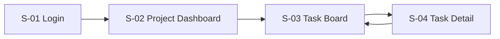

# UI/UX Spec — TeamTask

## Thông tin tài liệu (Document Metadata)

| Trường                           | Giá trị                                        |
| -------------------------------- | ---------------------------------------------- |
| Tên dự án (Project)              | TeamTask                                       |
| Mã tài liệu (Doc ID)             | UIUX-001                                       |
| Loại (Type)                      | UI/UX Spec                                     |
| Phiên bản (Version)              | 1.0.0                                          |
| Trạng thái (Status)              | Approved                                       |
| Người viết (Author)              | Phạm Thị D (Designer)                          |
| Người duyệt (Approver)           | Nguyễn Văn A (PM)                              |
| Link thiết kế (Design link)      | Figma: https://figma.com/file/teamtask (ví dụ) |
| Ngày tạo (Created)               | 2026-05-26                                     |
| Cập nhật lần cuối (Last updated) | 2026-06-01                                     |

## 1. Tổng quan & Nguyên tắc thiết kế (Overview & Design Principles)

Giao diện tối giản, ưu tiên sự rõ ràng. Nguyên tắc: (1) một hành động chính rõ ràng mỗi màn hình; (2) trạng thái công việc nhận biết bằng màu; (3) thao tác phổ biến (tạo/đổi trạng thái task) trong tối đa 2 cú nhấp.

## 2. Hệ thống thiết kế (Design System)

| Thành phần               | Quy định                                                                                                  |
| ------------------------ | --------------------------------------------------------------------------------------------------------- |
| Màu sắc (Color palette)  | Primary `#2563EB` · Success `#16A34A` · Warning `#D97706` · Error `#DC2626` · Neutral `#1F2937`/`#6B7280` |
| Kiểu chữ (Typography)    | Font Inter; Heading 24/20/16px (weight 600); Body 14px (weight 400)                                       |
| Khoảng cách (Spacing)    | Hệ lưới 8px (8/16/24/32)                                                                                  |
| Thành phần (Components)  | Button (primary/secondary/ghost), Input, Select, Card (task card), Modal, Avatar, Badge trạng thái        |
| Biểu tượng (Iconography) | Bộ Lucide icons                                                                                           |

## 3. Sơ đồ trang (Sitemap / Screen List)

| ID   | Màn hình (Screen)                   | Mục đích                 | Quyền truy cập (Access) |
| ---- | ----------------------------------- | ------------------------ | ----------------------- |
| S-01 | Đăng nhập (Login)                   | Xác thực người dùng      | Công khai               |
| S-02 | Danh sách dự án (Project Dashboard) | Chọn/tạo dự án           | Đã đăng nhập            |
| S-03 | Bảng Kanban (Task Board)            | Xem & quản lý task       | Thành viên dự án        |
| S-04 | Chi tiết task (Task Detail)         | Xem/sửa task + bình luận | Thành viên dự án        |

## 4. Luồng người dùng (User Flow)

## 5. Đặc tả từng màn hình (Screen-by-screen Spec)

### S-01 — Đăng nhập (Login)

- **Mục đích (Purpose):** xác thực người dùng (hỗ trợ FR-01).
- **Thành phần chính (Key components):** input Email, input Mật khẩu, nút "Đăng nhập" (primary), link "Quên mật khẩu".
- **Các trạng thái (States):**
  - Đang tải (Loading): nút hiển thị spinner, vô hiệu hóa form.
  - Lỗi (Error): banner đỏ "Email hoặc mật khẩu không đúng" (không nói rõ trường nào sai — bảo mật).
  - Thành công (Success): chuyển sang S-02.
- **Tương tác (Interactions):** Enter để submit.
- **Đáp ứng đa thiết bị (Responsive):** form căn giữa, tối đa rộng 400px trên desktop, full-width trên mobile.
- **Kiểm tra dữ liệu & nội dung (Validation & Microcopy):** email đúng định dạng; mật khẩu ≥ 8 ký tự.

### S-02 — Danh sách dự án (Project Dashboard)

- **Mục đích (Purpose):** chọn dự án hoặc tạo mới (FR-02).
- **Thành phần chính:** lưới các Card dự án, nút "+ Tạo dự án" (primary), Modal tạo dự án.
- **Các trạng thái:**
  - Trống (Empty): minh họa + "Chưa có dự án nào. Tạo dự án đầu tiên của bạn."
  - Đang tải (Loading): skeleton card.
  - Lỗi (Error): banner + nút "Thử lại".
- **Tương tác:** nhấp card → mở S-03.
- **Responsive:** 3 cột (desktop) / 2 (tablet) / 1 (mobile).

### S-03 — Bảng Kanban (Task Board)

- **Mục đích (Purpose):** quản lý task theo cột trạng thái (FR-03, FR-04, FR-05, FR-07).
- **Thành phần chính:** 3 cột "To Do / In Progress / Done"; task card (tiêu đề, avatar assignee, badge hạn); nút "+ Thêm task" mỗi cột; thanh lọc (filter) theo assignee/trạng thái.
- **Các trạng thái:**
  - Trống (Empty): mỗi cột rỗng hiển thị gợi ý "Kéo task vào đây".
  - Đang tải (Loading): skeleton cột.
  - Lỗi (Error): toast "Không cập nhật được trạng thái, đã hoàn tác".
- **Tương tác:** kéo-thả (drag & drop) task giữa các cột → gọi API cập nhật `status`; nhấp task → mở S-04.
- **Responsive:** desktop hiển thị 3 cột ngang; mobile cuộn ngang hoặc chuyển tab theo cột.
- **Validation & Microcopy:** task quá hạn hiển thị badge đỏ.

### S-04 — Chi tiết task (Task Detail)

- **Mục đích (Purpose):** xem/sửa thông tin task và bình luận (FR-06).
- **Thành phần chính:** tiêu đề (sửa inline), mô tả, người phụ trách (assignee select), hạn (date picker), trạng thái, danh sách bình luận + ô nhập bình luận.
- **Các trạng thái:**
  - Đang tải (Loading): skeleton.
  - Lỗi (Error): banner khi tải/lưu thất bại.
  - Thành công (Success): lưu hiển thị toast "Đã lưu".
- **Tương tác:** mở dạng panel trượt từ phải (desktop) hoặc full-screen (mobile).
- **Validation & Microcopy:** tiêu đề bắt buộc, không để trống.

## 6. Khả năng truy cập (Accessibility — a11y)

- Tương phản màu (contrast) đạt WCAG AA (≥ 4.5:1 cho text).
- Điều hướng bàn phím (keyboard navigation) cho toàn bộ form; kéo-thả có phương án thay thế bằng menu "Chuyển sang…".
- Nhãn ARIA cho icon-button.

## 7. Bản mẫu (Prototype)

- Prototype tương tác: Figma (link ở metadata).

---

## Lịch sử thay đổi (Change History)

| Phiên bản | Ngày       | Người sửa  | Mô tả thay đổi                             |
| --------- | ---------- | ---------- | ------------------------------------------ |
| 0.1.0     | 2026-05-26 | Phạm Thị D | Khởi tạo wireframe                         |
| 1.0.0     | 2026-06-01 | Phạm Thị D | Hoàn thiện đặc tả 4 màn hình, duyệt bởi PM |
