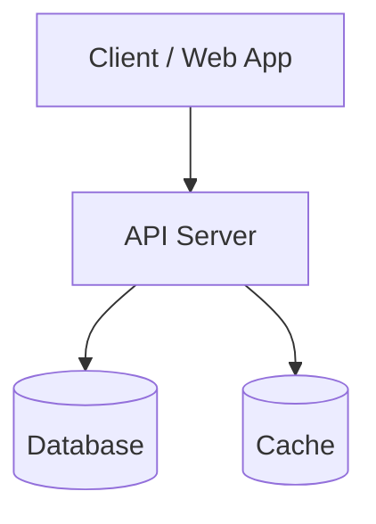
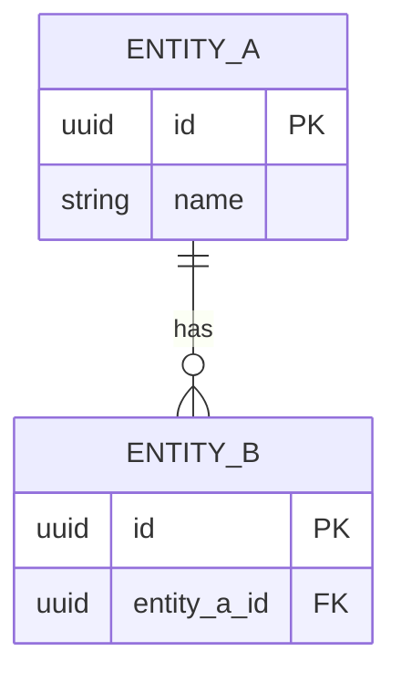
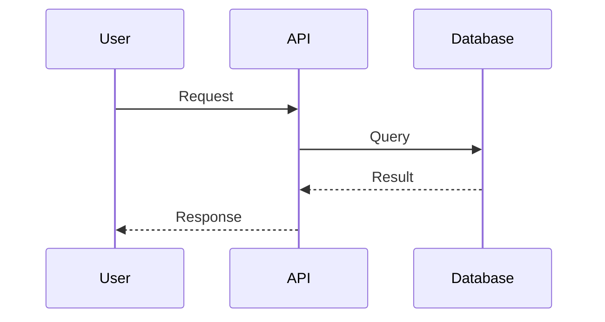

<!--
TEMPLATE: Technical Design Document (TDD — Tài liệu Thiết kế Kỹ thuật)
Hướng dẫn: copy file này, xóa chú thích <!-- -->, điền nội dung.

-->

# Technical Design — [Tên tính năng / dự án]

## Thông tin tài liệu (Document Metadata)

| Trường                           | Giá trị          |
| -------------------------------- | ---------------- |
| Tên dự án (Project)              |                  |
| Mã tài liệu (Doc ID)             | TDD-XXX          |
| Loại (Type)                      | Technical Design |
| Phiên bản (Version)              | 0.1.0            |
| Trạng thái (Status)              | Draft            |
| Người viết (Author)              |                  |
| Người duyệt (Approver)           |                  |
| Tài liệu liên quan (Related)     | PRD-XXX, API-XXX |
| Ngày tạo (Created)               | YYYY-MM-DD       |
| Cập nhật lần cuối (Last updated) | YYYY-MM-DD       |

## 1. Tổng quan & Mục tiêu kỹ thuật (Overview & Technical Goals)

<!-- Tóm tắt giải pháp kỹ thuật và những gì cần đạt được về mặt kỹ thuật. -->

## 2. Ràng buộc & Giả định (Constraints & Assumptions)

- **Ràng buộc (Constraints):**
- **Giả định (Assumptions):**

## 3. Kiến trúc tổng thể (Architecture Overview)

<!-- Giải thích các thành phần (components) và cách chúng giao tiếp. -->

## 4. Công nghệ sử dụng (Tech Stack)

| Tầng (Layer)                   | Công nghệ | Lý do chọn (Rationale) |
| ------------------------------ | --------- | ---------------------- |
| Frontend                       |           |                        |
| Backend                        |           |                        |
| Cơ sở dữ liệu (Database)       |           |                        |
| Hạ tầng (Infrastructure)       |           |                        |
| Dịch vụ bên thứ ba (3rd-party) |           |                        |

## 5. Mô hình dữ liệu (Data Model)

### 5.1. Sơ đồ ERD (Entity-Relationship Diagram)

<!--
Vẽ tổng quan các thực thể (entity) và quan hệ. Trong mỗi entity, ghi field chính kèm
ký hiệu: PK = khóa chính, FK = khóa ngoại, UK = khóa duy nhất.
Lực lượng quan hệ (cardinality) trong Mermaid: || một, o{ nhiều, |o một (tùy chọn / nullable).
-->

> Ký hiệu: `PK` = khóa chính (Primary Key), `FK` = khóa ngoại (Foreign Key), `UK` = khóa duy nhất (Unique Key).

### 5.2. Quan hệ (Relationships)

<!-- Mô tả từng quan hệ bằng lời, nêu rõ lực lượng: một–một (1-1), một–nhiều (1-n), nhiều–nhiều (n-n, cần bảng nối). -->

- Một **ENTITY_A** có nhiều **ENTITY_B** → quan hệ **một–nhiều (one-to-many)**.

### 5.3. Chi tiết các bảng (Table Details)

<!-- Mỗi bảng MỘT bảng mô tả đầy đủ field. Lặp lại block dưới cho từng bảng. -->

#### Bảng `entity_a`

| Trường (Field) | Kiểu (Type)  | Ràng buộc (Constraint)    | Mô tả         |
| -------------- | ------------ | ------------------------- | ------------- |
| id             | uuid         | PK                        | Định danh     |
| name           | varchar(100) | NOT NULL                  |               |
| created_at     | timestamptz  | NOT NULL, default `now()` | Thời điểm tạo |

### 5.4. Giá trị liệt kê (Enums)

<!-- Liệt kê các trường dạng enum và tập giá trị hợp lệ. -->

| Trường            | Giá trị hợp lệ (Allowed values) |
| ----------------- | ------------------------------- |
| `entity_a.status` | `value_1` · `value_2`           |

## 6. Thiết kế thành phần (Component Design)

<!-- Mô tả từng module/service: trách nhiệm (responsibility), input/output. -->

## 7. Luồng xử lý chính (Key Sequence Flows)

## 8. Tham chiếu API (API Reference)

<!-- Liên kết tới API Spec: ./04-api-spec.md -->

## 9. Bảo mật (Security)

- Xác thực (Authentication):
- Phân quyền (Authorization):
- Dữ liệu nhạy cảm (Sensitive data) & mã hóa (Encryption):

## 10. Hiệu năng & Khả năng mở rộng (Performance & Scalability)

<!-- Dự kiến tải (load), caching, indexing, chiến lược mở rộng (scaling strategy). -->

## 11. Ghi log & Giám sát (Logging & Monitoring)

<!-- Log gì, công cụ giám sát (monitoring), cảnh báo (alerting). -->

## 12. Kế hoạch triển khai (Deployment Plan)

- Môi trường (Environments): Dev / Staging / Production
- CI/CD:
- Di trú dữ liệu (Migration):
- Quay lui (Rollback):

## 13. Phương án thay thế đã cân nhắc (Alternatives Considered)

| Phương án | Ưu điểm | Nhược điểm | Lý do không chọn |
| --------- | ------- | ---------- | ---------------- |
|           |         |            |                  |

## 14. Rủi ro kỹ thuật (Technical Risks)

| Rủi ro | Ảnh hưởng | Phương án giảm thiểu (Mitigation) |
| ------ | --------- | --------------------------------- |
|        |           |                                   |

## 15. Câu hỏi mở (Open Questions)

- [ ]

---

## Lịch sử thay đổi (Change History)

| Phiên bản | Ngày       | Người sửa | Mô tả thay đổi             |
| --------- | ---------- | --------- | -------------------------- |
| 0.1.0     | YYYY-MM-DD |           | Khởi tạo bản nháp đầu tiên |
