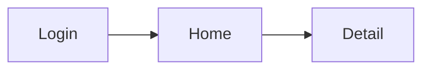

<!--
TEMPLATE: UI/UX Specification (Đặc tả Giao diện & Trải nghiệm)
Hướng dẫn: copy file này, xóa chú thích <!-- -->, điền nội dung.

-->

# UI/UX Spec — [Tên tính năng / dự án]

## Thông tin tài liệu (Document Metadata)

| Trường                           | Giá trị    |
| -------------------------------- | ---------- |
| Tên dự án (Project)              |            |
| Mã tài liệu (Doc ID)             | UIUX-XXX   |
| Loại (Type)                      | UI/UX Spec |
| Phiên bản (Version)              | 0.1.0      |
| Trạng thái (Status)              | Draft      |
| Người viết (Author)              |            |
| Người duyệt (Approver)           |            |
| Link thiết kế (Design link)      | Figma: ... |
| Ngày tạo (Created)               | YYYY-MM-DD |
| Cập nhật lần cuối (Last updated) | YYYY-MM-DD |

## 1. Tổng quan & Nguyên tắc thiết kế (Overview & Design Principles)

<!-- Định hướng trải nghiệm, tông giọng (tone), nguyên tắc chính. -->

## 2. Hệ thống thiết kế (Design System)

| Thành phần               | Quy định                                        |
| ------------------------ | ----------------------------------------------- |
| Màu sắc (Color palette)  | Primary / Secondary / Success / Warning / Error |
| Kiểu chữ (Typography)    | Font, cỡ chữ (size), độ đậm (weight)            |
| Khoảng cách (Spacing)    | Hệ lưới (grid), đơn vị spacing                  |
| Thành phần (Components)  | Button, Input, Card, Modal...                   |
| Biểu tượng (Iconography) | Bộ icon dùng                                    |

## 3. Sơ đồ trang (Sitemap / Screen List)

| ID   | Màn hình (Screen) | Mục đích | Quyền truy cập (Access) |
| ---- | ----------------- | -------- | ----------------------- |
| S-01 |                   |          |                         |

## 4. Luồng người dùng (User Flow)

## 5. Đặc tả từng màn hình (Screen-by-screen Spec)

### S-01 — [Tên màn hình]

- **Mục đích (Purpose):**
- **Thành phần chính (Key components):**
- **Các trạng thái (States):**
  - Trống (Empty):
  - Đang tải (Loading):
  - Lỗi (Error):
  - Thành công (Success):
- **Tương tác (Interactions):**
- **Đáp ứng đa thiết bị (Responsive — breakpoints):** Mobile / Tablet / Desktop
- **Kiểm tra dữ liệu & nội dung (Validation & Microcopy):**

<!-- Lặp lại block trên cho từng màn hình. -->

## 6. Khả năng truy cập (Accessibility — a11y)

<!-- Tương phản màu (contrast), điều hướng bàn phím (keyboard nav), nhãn ARIA. -->

## 7. Bản mẫu (Prototype)

<!-- Link prototype tương tác / bản hi-fi. -->

---

## Lịch sử thay đổi (Change History)

| Phiên bản | Ngày       | Người sửa | Mô tả thay đổi             |
| --------- | ---------- | --------- | -------------------------- |
| 0.1.0     | YYYY-MM-DD |           | Khởi tạo bản nháp đầu tiên |
